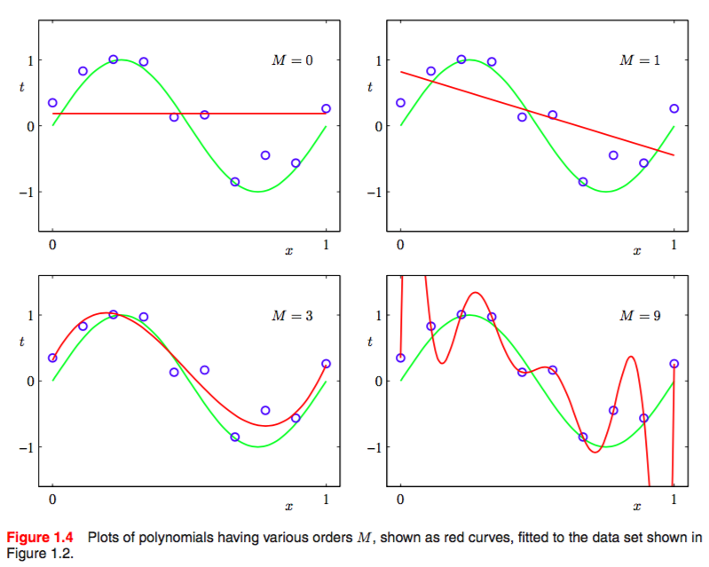
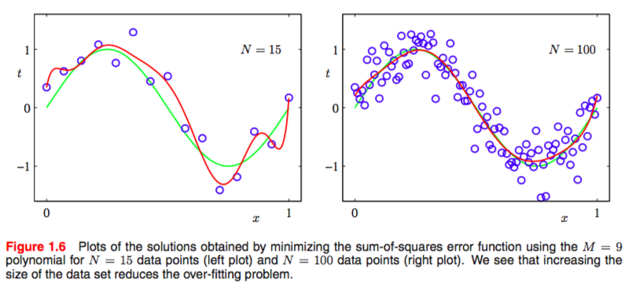
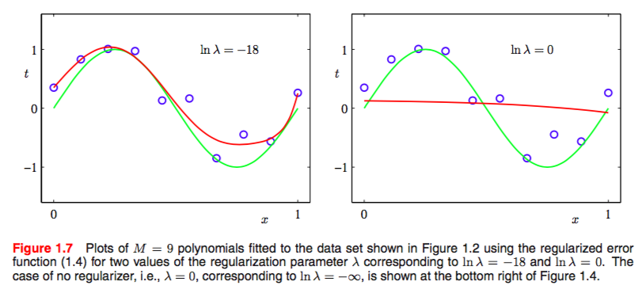
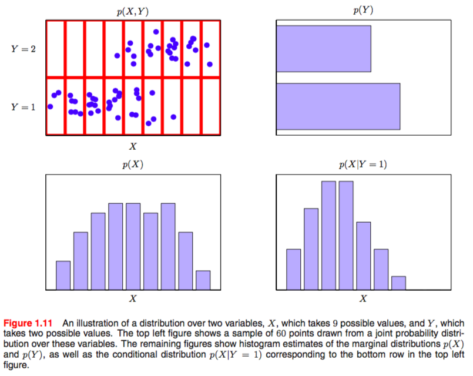
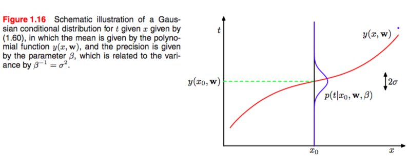
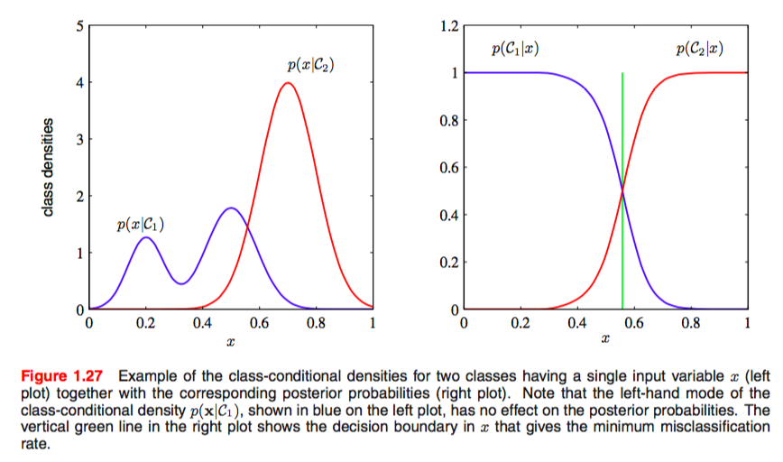

# Intro

### Paradigms

* Supervised Learning

  $ Given\ D = \{X_i, Y_i\},\  learn\  f(\cdot ): Y_i = f(X_i),\  s.t. D^{new} = \{X_j\} => \{Y_j\} $

* Unsupervised Learning

  $ Given\ D = \{X_i\},\  learn\  f(\cdot ): Y_i = f(X_i),\  s.t. D^{new} = \{X_j\} => \{Y_j\} $

### Example 

Polynomial curve fitting

Fit the data using a polynomial function of the form:

$ y(x, \bf{w}) = w_0 + w_1x + ... +w_Mx^M = \sum\limits_{j=0}^Mw_jx^j$

$ \bf w $ is the parameters we need to adapt according to dataset $ \{(x_n, y_n)\}_N $

Minimize "loss function" to find the w:

$ \bf w = argmin_w\{E(w)\} , E(w) = \frac{1}{2}\sum\limits_{n=1}^N\{y(x_n,\bf{w}) -t_n\}^2 $

#### Overfitting

​	For M = 9, the training set error goes to zero, while test set error become very large due to overfitting. The reason is that we have 10 coefficients($ w_0\ to\ w_9 $) thus containing **10 degrees of freedom, and so they can be tuned exactly to the 10 data points in the training set**.

#### Avoid overfitting(1)

**More data**

### 

#### Avoid overfitting(2)

Loss function with **panalty item(or regularization) ** on ||w||

$ E(w) = \frac{1}{2}\sum\limits_{n=1}^N\{y(x_n,\bf{w}) -t_n\}^2 + \frac{\lambda}{2}||\bf w||^2 $

### Probability Theory

#### Rules of Probability

* **sum rule:**  $ p(Y) = \sum\limits_{Y}{p(X, Y)} $ 
* **product rule:**  $ p(Y, X) = p(Y|X)P(X) $
* **Bayes' theorem: ** $p(Y|X)=\frac{p(X|Y)p(Y)}{P(X)},\  P(X)=\sum\limits_Yp(X|Y)p(Y)$

#### Probability densities

$ p(x\in(a,b))=\int_a^bp(x)dx,\ p(x)\ge0:\ density\ function $ 

* Note: Under a **nonlinear change of variable**, a probability density transforms differently from a simple function, due to the **Jacobian factor**.  
  $$
  given\ x = g(y)\\
  \because p_x(x)dx \simeq p_y(y)dy\\
  \begin{aligned}
  \therefore p_y(y) &= p_x(x)|\frac{dx}{dy}|\\
  &=p_x(g(y))
  \end{aligned}
  $$
  One consequence of this property is that the concept of the maximum of a probability density is **dependent on the choice of variable**. 

#### Expectations and covariances

$ E[f]=\sum\limits_xp(x)f(x),\ E[f]=\int p(x)f(x)dx $

$var[f] = E[(f(x)-E[f])^2] = E[f^2]-E[f(x)]^2$

$ cov[x, y] = E_{x,y}[(x-E[x])(y-E[y])] = E_{x,y}[xy] - E[x]E[y] $

$ cov[\bf x, \bf y] = E_{x,y}[{\bf x - E[\bf x]}{\bf y^T-E[\bf y^T]}] = E_{x,y}[\bf {xy^T}]-E[\bf x]E[\bf y^T] $

#### Bayes' View

Bayes’ theorem was used to **convert a prior probability into a posterior probability by incorporating the evidence provided by the observed data**. 

Prior probability can be regarded as **knowledge gained before or "common sense"**.

From frequests' view, the **w** learned from dataset is fixed(by maximize likelihood function), while From Bayes' view, it's an uncertain variable represented by a probability distribution $ p(\bf w) $.

Common path of Bayes' learning:

**Loop** 

1. prior: $ p(\bf w) $
2. Observed dataset: $ D={t_1,...,t_N} $
3. Posterior: $ p(\bf{w}|D)=\frac{p(D|\bf w)p(\bf w)}{p(D)} $ and regard it as new prior(updated by observations).

$ posterior \propto likelihood \times prior$ 

$p(D)=\bf \int p(D|w)p(w)dw$

#### Gaussian distribution

$ \mathcal{N}(x|\mathcal{u}, \sigma^2) = \frac{1}{\sqrt{2\pi\sigma^2}}exp\{-\frac{1}{2\sigma^2}(x-\mathcal{u})^2\} $

$ \mathcal{N}(x|u, \sum) = \frac{1}{\sqrt{(2\pi)^D|\sum|}}exp\{-\frac{1}{2}(x-u)^T\sum^{-1}(x-u)\} $

#### Revisit Curve fitting

Given dataset: $ {\bf x} = (x_1,...,x_N)^T $, $ {\bf t}= (t_1,...,t_N)T $

We assume: $ p(t|x,{\bf w},\beta) = \mathcal{N}(t|y(x,{\bf w}),\beta^{-1})  $

Likelihood function:
$$
\begin{aligned}
p({\bf t}|{\bf x, w},\beta) &= \prod\limits_{n=1}^N\mathcal{N}(t_n|\ y(x_n,{\bf w}),\beta^{-1})\\
&=\prod\limits_{n=1}^N(\frac{\beta}{2\pi})^{\frac{1}{2}}e^{-\frac{\beta}{2}(y(x_n,{\bf w})-t_n)^2}
\end{aligned}
$$
Log likelihood:
$$
lnp({\bf t}|{\bf x, w},\beta) = -\frac{\beta}{2}\sum\limits_{n=1}^N\{y(x_n, {\bf w})-t_n\}^2+\frac{N}{2}ln\beta-\frac{N}{2}ln(2\pi)
$$
Maximize log likelihood with respect to $\bf w$ is equivalent to maximize **sum-of-squares error function** defined before. While maximize it with respect to $\beta$ gives:
$$
\frac{1}{\beta_{ML}} = \frac{1}{N}\sum\limits_{n=1}^N\{y(x_n, {\bf w_{ML}} ) - t_n\}^2
$$
Predict:
$$
p(t|x,{\bf w_{ML},\beta_{ML}})=\mathcal{N}(t|y(x, {\bf w_{ML}}), \beta_{ML}^{-1})
$$
Introduce a prior distribution over $ \bf w:$ 

$ \ p({\bf w}|\alpha) = \mathcal{N}({\bf w}|{\bf 0, \alpha^{-1}I})=(\frac{\alpha}{2\pi})^{(M+1)/2}exp\{-\frac{\alpha}{2}{\bf w^Tw}\} $

posterior for $ \bf w: $ 

 $ p({\bf w}|{\bf x,t},\alpha, \beta) \propto p({\bf t}|{\bf x, w}, \beta) p({\bf w}|\alpha) $

Maximum posterior(MAP): 

$ \bf w_{MAP}=\min\limits_{\bf w}ln\ p({\bf w}|{\bf x,t},\alpha, \beta)=\min\limits_{\bf w}\{\frac{\beta}{2}\sum\limits_{n=1}^N[y(x_n,{\bf w}) - t_n]^2 + \frac{\alpha}{2}\bf{w^Tw}\} $

**Thus, maximizing the posterior distribution is equivalent to minimizing the regularized sum-of-squares error function.**

#### Bayesian Curve fitting

MAP(maximizing the posterior) and ML(maximizing the likelihood) are both "**point estimate**" methods. 

A more Bayesian way is introduced:
$$
\begin{aligned}
p(t|x,{\bf x, t})&=\int p(t|x,{\bf w})p({\bf w|t,x})d{\bf w}\\
&=\mathcal{N}(t|m(x),s^2(x))
\end{aligned}
$$
where the mean and var will be given and discussed in detail in Chapter 3.

#### Problems when dimen goes high

* too many coefficients.

* Our geometrical intuitions, formed through a life spent in a space of three dimensions, can fail badly when we consider spaces of higher dimensionality. 

  **Example:** 

  Consider a sphere of radius r = 1 in a space of D dimensions, and ask what is the fraction of the volume of the sphere that lies between radius r = 1 − $\epsilon$ and r = 1. We can evaluate this fraction by noting that the volume of a sphere of radius r in D dimensions must scale as $ r^D $, and so we write 
  $$
  V_D(r) = K_Dr^D\\
  \frac{V_D(1)-V_D(1-\epsilon)}{V_D(1)}=1-(1-\epsilon)^D
  $$
  for large D(high dimen space), the fraction tends to 1 even for small $ \epsilon $. Which means most of the volume of a sphere in high-dimen space is **concentrated in a thin shell near the surface.**

### Decision theory

Two stages of typical machine learning:

* Inference: Determine $ p({\bf x, t})\ or\ p({\bf t|x}) $ from training dataset.

* Decision: choose the best $ \bf t $ given $ {\bf x}\ and\ p({\bf x, t})\ or\ p({\bf t|x})$
  $$
  \begin{aligned}
  p(mistake)&=p(x \in R_1,C_2)+p(x \in R_2, C_1)\\
  &=\int_{R_1}p(x, C_2)dx+\int_{R_2}p(x,C_1)dx
  \end{aligned}
  $$
  so, we should choose the bigger $ p(x, C_k) $ to minimize the mistake. Also, because $ p(x, C_k)=p(x|C_k)p(x) $, we should choose the bigger $ p(x|C_k) $.

#### reject option

Introduce a threshold $ \theta $ and make no decisions when the largest probability $ p(C_k|{\bf x}) $ is less than $ \theta $

#### generative and discriminative

##### classification problem

**(a)** First solve the inference problem of $ p(x|C_k)\ and\ p(C_k)$, then use Bayes' theorem to get $ p(C_k|x) $

Equivalently, we can model $ p(x,C_k) $ and then normalize to obtain the posterior distribution.

**(b)** Solve the inference problem of $ p(C_k|x) $ directly.

* (a) is known as **generative model**, (b) is called **discriminative model**

(a) need more computation but provides more information about data distribution. (b) is more efficient.

**Example:**

$ p(C_k|x) $ can be used to determine class directly, while $ p(x|C_k) $ contains raw info about data distribution.

##### regression problem

(a) First solve the inference problem of determining the joint density $p(x, t)$. Then normalize to find the conditional density $p(t|x)$, and finally marginalize to find the conditional mean. 

 (b) First solve the inference problem of determining the conditional density $p(t|x)$,  and then subsequently marginalize to find the conditional mean.

 (c) Find a regression function $ y(x) $ directly from the training data. 